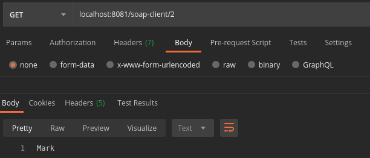
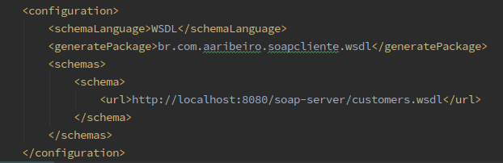
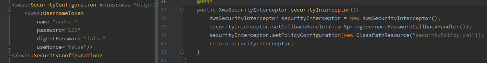
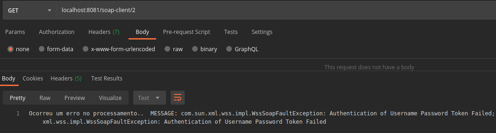

# Soap-Client
Microserviço responsável por integrar informações Rest com web-service SOAP.

Este projeto simula um cliente utilizando uma API Rest para consultar dados em um web-service SOAP.

Nesta integração este microserviço captura os dados enviados via requisição (request) e aplica as regras de negócio necessárias, para posteriormente converter os dados em objeto SOAP para envio ao o web-service https://github.com/andreiRibeiro/BACKEND-SoapServer que irá processar esta requisição SOAP e devolver a este microserviço (response) os dados solicitados.

#### 1) Eh possível via API solicitar o nome de um cliente infomando neste caso o id.

#### 2) O sistema realiza o parse dos objetos através dos schemas fornecidos pelo web-service via WSDL.

#### 3) O sistema adiciona em seu objeto SOAP de envio, usuario e senha (securityPolicy) solicitados pelo web-service.

#### 4) Caso usuário e/ou senha do microserviço estejam inválidos, o web-service retornará uma mensagem de erro.

